<!--
  Profile README for github.com/N1mblexe
  - assets/banner.svg   : hand-built banner (Unity Animator graph, text outlined, animated with CSS)
  - profile/*.svg       : stats cards, regenerated daily by .github/workflows/readme-cards.yml
  Lines marked TODO are placeholders only you can fill in. HTML comments never render on GitHub.
-->

  

  
  
  
  
  

## About

I'm the core gameplay programmer at **[2E](https://store.steampowered.com/developer/2E)**, an independent two-person studio with four released games on Steam and a fifth in development. I build the parts players feel before they can name them: core mechanics, gameplay loops, state machines, and event-driven systems that keep features from tangling into each other.

I started in 2019 writing C for Arduino and ESP32 boards, then moved into games.

- Designed the in-game economy and battle pass for **Roboroar**, a multiplayer mech arena on Android and iOS with 10K+ downloads on Google Play
- 🥈 2nd place at the Konya Technical University Project Fair with a VR simulation built in Unity and Blender
- Currently building **[HeHe Remake](https://store.steampowered.com/app/3152740/HeHe_Remake/)** at 2E <!-- TODO: confirm, or replace with what you're actually on -->

## Games

<table>
  <tr>
    <td colspan="2" align="center">
       
      <b>HeHe Remake</b>, in development 
      Mining survival underground, hunted by ReRe's spawn. <a href="https://store.steampowered.com/app/3152740/HeHe_Remake/">Wishlist on Steam</a>
      <!-- TODO: one line on the system you own here, e.g. "I built the enemy spawner and the dig/terrain system." -->
    </td>
  </tr>
  <tr>
    <td width="50%" align="center" valign="top">
       
      <b>HaHa</b>, 2024 
      Arena shooter roguelite against endless enemy hordes
      <!-- TODO: your contribution -->
    </td>
    <td width="50%" align="center" valign="top">
       
      <b>HiHi</b>, 2024 
      Vertical platformer: jump up, don't fall
      <!-- TODO: your contribution -->
    </td>
  </tr>
  <tr>
    <td width="50%" align="center" valign="top">
       
      <b>Bad-Draw</b>, 2024 
      2D platformer about a hand-drawn character's revenge
      <!-- TODO: your contribution -->
    </td>
    <td width="50%" align="center" valign="top">
       
      <b>hehe</b>, 2022 
      2D platform survival: a sugar cube versus the tea monster
      <!-- TODO: your contribution -->
    </td>
  </tr>
</table>

## What I build

| System | What it solves | Where it shipped |
| --- | --- | --- |
| **State machines** | Character, AI and game-flow states without if/else sprawl | 2E games |
| **Event systems** | Decoupled messaging, so gameplay systems never hold hard references to each other | 2E games |
| **Economy and battle pass** | Reward pacing and progression balance for a live free-to-play game | [Roboroar](https://play.google.com/store/apps/details?id=com.mvs.roboroar) (MVS Games) |
| **Developer console** | Source-engine-style runtime console for testing and debugging in builds | [Unity-Console-Asset](https://github.com/N1mblexe/Unity-Console-Asset) |
| **VR simulation** | Full VR project modelled in Blender, built in Unity | KTUN Project Fair, 2nd place |

<!-- TODO: every row without a code link is a claim a reviewer can't check. Extract one system per month into a small public repo with a GIF and link it here. -->

## Tools

  
  
  
  
  
  

  From the embedded days: 
  
  
  

## GitHub activity

  <picture>
    <source media="(prefers-color-scheme: dark)" srcset="./profile/stats-dark.svg" />
    
  </picture>
  <picture>
    <source media="(prefers-color-scheme: dark)" srcset="./profile/top-langs-dark.svg" />
    
  </picture>

Most of my production code lives in private studio repositories, so these cards only show part of the picture.

---

  Ankara, Türkiye. Turkish (native) and English. 
  Want to see what I work on next? <a href="https://store.steampowered.com/app/3152740/HeHe_Remake/">Wishlist HeHe Remake</a>.

